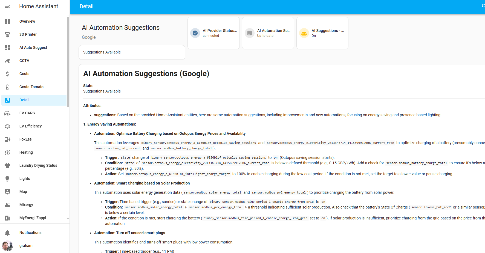

# AI Automation Suggester

An integration for Home Assistant that leverages AI models to understand your unique home environment and propose intelligent automations. By analyzing your entities, devices, areas, and existing automations, the AI Automation Suggester helps you discover new, context-aware use cases you might not have considered, ultimately streamlining your home management and improving efficiency, comfort, and convenience.

---

## Purpose and Problem Statement

As a modern smart home grows in complexity—encompassing lights, sensors, locks, climate systems, cameras, and more—it can be challenging to figure out how these devices should interact to achieve a seamless, automated living experience. Many users find themselves overwhelmed by the sheer number of possibilities, unsure which triggers and conditions would genuinely enhance their daily routines.

**This integration solves that challenge** by acting as a personal automation consultant. It taps into advanced AI language models to:

- **Analyze your home’s state**: Understand what devices and sensors you have, their capabilities, and how they relate to one another.
- **Identify opportunities for improvement**: Suggest automations that can save energy, improve security, enhance comfort, and reduce manual intervention.
- **Provide step-by-step automation ideas**: Present actionable YAML-based automations that you can tweak and implement directly, cutting down the complexity of writing automations from scratch.

**In essence**, the AI Automation Suggester turns the complexity of a large Home Assistant environment into actionable insights and tangible benefits.

---

---

## The Solution and How It Works

1. **Entity and Automation Analysis**:  
   The integration collects data on your Home Assistant entities (like sensors, switches, lights, and climate devices) and existing automations. It also pulls in device and area information for richer context. Instead of generic, one-size-fits-all suggestions, the AI can consider, for example, that a temperature sensor in the living room and a motion sensor in the hallway could jointly trigger specific lighting or climate adjustments.

2. **AI-Powered Suggestions**:  
   By using cutting-edge AI models (OpenAI, Anthropic, Google, Groq, LocalAI, and Ollama), the integration transforms this snapshot of your home into meaningful suggestions. These suggestions can include:
   - Energy-saving strategies: Turn off lights or appliances automatically when certain conditions are met.
   - Security enhancements: Alert you if doors remain open too long or if certain presence conditions are detected.
   - Comfort improvements: Adjust lights, climate, or media devices based on time of day, occupancy, or environmental conditions.
   - Maintenance and convenience: Remind you when it's time to run appliances, or combine multiple conditions into a single efficient routine.

3. **Prompt Customization and Scope Control**:  
   You’re not stuck with a single set of suggestions. Filter entities by domain, limit how many entities the AI considers, and provide custom prompts (e.g., "Focus on presence-based lighting control" or "Suggest cost-saving automations"). Randomized entity selection ensures that each analysis can present fresh ideas rather than repeating the same suggestions.

4. **Integration with Your Workflow**:  
   Suggestions appear as persistent notifications, allowing you to review and implement them at your own pace. They’re presented as Home Assistant YAML snippets, making it straightforward to adapt and integrate them into your actual `automation.yaml` or UI-based automations.

---

## Expected Output and Benefits

**Expected Output**:
- **Actionable Automation Scenarios**: Concrete YAML examples that you can copy and paste into your Home Assistant configuration.
- **Context-Aware Recommendations**: Ideas that consider both the location and capabilities of your devices, so you get realistic and tailored suggestions, not just generic advice.
- **Optimized Home Management**: By refining the automations, you can reduce energy usage, enhance security, and increase convenience, turning your home into a more efficient and responsive environment.

**Key Benefits**:
- **Time Saving**: Cuts down the guesswork of designing automations from scratch.
- **Improved Usability**: Makes Home Assistant more approachable for those without deep automation writing experience.
- **Dynamic Inspiration**: Keeps your automations evolving as your home changes, devices are added, or new goals arise.
- **Enhanced Control**: Custom prompts, entity limits, and domain filters give you command over what kinds of suggestions are generated.

---
***Snapshot View***

---
***Ideas for Dashboard***

You have the ability to build your own dashboard to show the suggestions on one page however you want. 

A basic dashboard suggestion would be to use the Markdown Card.
In the Content of the Markdown Card insert the following:

`{{ state_attr('sensor.ai_automation_suggestions_localai', 'suggestions') }}`

Replace the sensor with the name of your sensor entity.  The state_attr function retrieves the value of the suggestions attribute from the sensor which is where the results are stored.

## Table of Contents

- [Purpose and Problem Statement](#purpose-and-problem-statement)
- [The Solution and How It Works](#the-solution-and-how-it-works)
- [Expected Output and Benefits](#expected-output-and-benefits)
- [Features](#features)
- [Prerequisites](#prerequisites)
- [Installation](#installation)
  - [Installing via HACS (Recommended)](#installing-via-hacs-recommended)
  - [Manual Installation](#manual-installation)
- [Configuration](#configuration)
- [Usage](#usage)
  - [Automatic Suggestions](#automatic-suggestions)
  - [Manual Trigger](#manual-trigger)
- [Customization and Advanced Usage](#customization-and-advanced-usage)
  - [Random Entity Selection](#random-entity-selection)
  - [Domain Filtering](#domain-filtering)
  - [Entity Limit](#entity-limit)
  - [Custom Prompts](#custom-prompts)
- [Implementing Automations](#implementing-automations)
- [Sensors](#sensors)
- [Important Notes](#important-notes)
- [Troubleshooting](#troubleshooting)
- [Roadmap](#roadmap)
- [License](#license)
- [Acknowledgments](#acknowledgments)
- [Contributions](#contributions)
- [Disclaimer](#disclaimer)
- [Support the Project](#support-the-project)
- [Additional Information](#additional-information)
- [FAQ](#faq)

---

## Features

- **Multi-Provider Support**: Use OpenAI, Anthropic, Google, Groq, LocalAI, or Ollama.
- **Customizable Prompts and Filters**: Tailor suggestions to focus on energy saving, presence, or any theme of your choice.
- **Randomized and Domain-Filtered Entities**: Control the pool of entities and prevent repetitive or too-generic suggestions.
- **Context-Rich Insights**: Incorporates device and area registry info, making suggestions smarter and more relevant.
- **Persistent Notifications**: Receive suggestions right in your Home Assistant interface.

---

## Prerequisites

- **Home Assistant:** Version 2023.5 or later.
- **AI Provider Setup:**  
  For cloud providers (OpenAI, Anthropic, Google, Groq), you’ll need API keys.  
  For local models (LocalAI, Ollama), ensure the local servers are running.
  
---

## Installation

### Installing via HACS (Recommended)  **New!** - This Custom Integration is now available directly in the HACS search repo!

1. **Install HACS** if not already done.
2. **Add Custom Repository**:  
   In HACS > Integrations, add `https://github.com/ITSpecialist111/ai_automation_suggester`.
3. **Install Integration** from HACS.
4. **Restart Home Assistant**.

### Manual Installation

1. **Download** this repository.
2. **Copy** `ai_automation_suggester` to `custom_components/`.
3. **Restart Home Assistant**.

---

## Configuration

1. **Add Integration via UI**:  
   Go to Settings > Devices & Services > Add Integration > AI Automation Suggester.
2. **Select Provider and Keys**:  
   Provide API keys or local model details as needed.  
3. **Set Model and Max Tokens**:  
   Choose your model variant and output length.
4. **(Optional) Custom Prompt**:  
   Add a custom system prompt during integration setup or when triggering services.

---

## Usage

### Automatic Suggestions

- **On New Entities**: The integration suggests automations whenever new entities are added, helping you quickly integrate them into your ecosystem.
- **Weekly Reviews**: Example automations can trigger comprehensive scans weekly or at custom intervals.

### Manual Trigger

- **Service Call**:  
  Developer Tools > Services > `ai_automation_suggester.generate_suggestions`
  - **all_entities**: Consider all or only new ones.
  - **domains**: Limit to specific domains.
  - **entity_limit**: Control how many entities to consider.
  - **custom_prompt**: Steer suggestions towards energy saving, presence, or other goals.

---

## Customization and Advanced Usage

### Random Entity Selection

Ensures that each run may surface new or previously overlooked entities, sparking fresh automation ideas.

### Domain Filtering

Focus suggestions on `light`, `sensor`, or any domain to refine the results and avoid irrelevant suggestions.

### Entity Limit

Set a maximum number of entities analyzed to avoid overwhelming the AI model or hitting token limits.

### Custom Prompts

Add directions like "Focus on cost-saving strategies" or "Emphasize presence-based lighting" to shape the AI’s recommendations to your current priorities.

---

## Implementing Automations

- **Review Suggestions in Notifications**:  
  Each suggestion is a ready-to-use YAML snippet.
- **Copy and Adapt**:  
  Paste suggestions into your `automation.yaml` or edit via the UI. Adjust triggers, conditions, or actions as needed.

---

## Sensors

- **AI Automation Suggestions Sensor**:  
  Displays the current suggestion status and stores the latest suggestions.
- **AI Provider Status Sensor**:  
  Indicates the connection health with your chosen AI provider.

---

## Important Notes

- **Privacy Considerations**:  
  Cloud-based AI providers receive entity data. Consider local providers for full data control.
- **API Costs**:  
  Some providers charge for API usage. Monitor your usage and configure limits.
- **No Guarantees**:  
  Suggestions are best-effort. Always review before implementing them in your live system.

---

## Troubleshooting

- **No Suggestions?**  
  Check logs, verify API keys, try manually triggering the service.
- **Prompt Too Long?**  
  Reduce `entity_limit`, filter domains, or shorten your prompt.
- **Unintended Startup Suggestions?**  
  Ensure no automations or events call `generate_suggestions` on startup.

---

## Roadmap

- **More Interactive Suggestions**:  
  Potential feedback mechanisms to improve future recommendations.
- **One-Click Automation Creation**:  
  Streamline from suggestions directly to implemented automations.
- **Expanded Localization**:  
  Support for more languages and community-driven translations.

---

## License

This project is licensed under the MIT License. See LICENSE for details.

---

## Acknowledgments

- **Home Assistant Community**: For a flexible and powerful platform.
- **AI Providers**: OpenAI, Anthropic, Google, Groq, LocalAI, Ollama for enabling these capabilities.
- **Contributors and Users**: Providing feedback and helping guide improvements.

---

## Contributions

We welcome pull requests, feature suggestions, and translations. Please open an issue or submit a PR on GitHub.

---

## Disclaimer

This is a custom component, not affiliated with or endorsed by Home Assistant or the AI providers mentioned.

---

## Support the Project

If you find this helpful, consider supporting development:

[Buy Me A Coffee](https://www.buymeacoffee.com/ITSpecialist)

Your support helps maintain and enhance this project!

---

## Additional Information

For questions or issues, open an issue on GitHub. We appreciate user feedback to guide future improvements.

---

## FAQ

1. **How do I update the integration?**  
   If installed via HACS, update through the HACS interface. Otherwise, replace the files manually and restart.

2. **Can I use it without an API key?**  
   Yes, if you choose LocalAI or Ollama, no external API keys are required.

3. **Is my data safe?**  
   Using local models keeps data local. For cloud providers, refer to their privacy policies.

4. **I found a bug or have a feature request.**  
   Open an issue on GitHub. Your feedback is valuable.

5. **Can I get suggestions in languages other than English?**  
   English and German are included. We welcome community translations!

---

With the AI Automation Suggester, you gain an AI-powered ally to help you unlock your home’s full potential. Instead of being overwhelmed by possibilities, receive thoughtful, context-aware suggestions that make your Home Assistant automations more impactful, efficient, and enjoyable.
